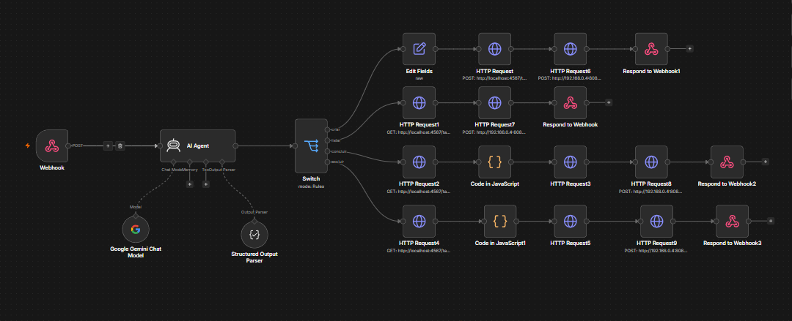

# TODO Manager via WhatsApp

Um gerenciador de tarefas controlado por **WhatsApp**, desenvolvido com foco em aprendizado de **Engenharia de Software**, integração entre sistemas e arquitetura de aplicações modernas.



O projeto permite criar, listar, concluir e excluir tarefas através de mensagens em linguagem natural utilizando Inteligência Artificial.

---

## Arquitetura

```text
Usuário
    │
    ▼
WhatsApp
    │
    ▼
Evolution API
    │
(Webhook)
    │
    ▼
n8n
    │
    ├──► Gemini (IA)
    │
    ▼
Express API
    │
    ▼
PostgreSQL
    │
    ▼
Resposta
    │
    ▼
WhatsApp
```

---

## Funcionalidades

- Criar tarefas
- Listar tarefas
- Concluir tarefas
- Excluir tarefas
- Interpretação de linguagem natural com IA
- Automação de fluxos utilizando n8n
- Integração com WhatsApp através da Evolution API

---

## Tecnologias

### Backend

- Node.js
- TypeScript
- Express

### Banco de Dados

- PostgreSQL

### Automação

- n8n

### Inteligência Artificial

- Google Gemini

### Integração

- Evolution API

---

## Estrutura do Projeto

```text
todo-manager/
│
├── backend/
│   ├── src/
│   ├── package.json
│   └── tsconfig.json
│
├── learning/
│   └── estudos realizados durante o desenvolvimento
│
├── docs/
│   └── documentação e especificações
│
└── README.md
```

---

## Como executar

### 1. Clone o repositório

```bash
git clone <url-do-repositorio>
```

### 2. Instale as dependências

```bash
cd backend
npm install
```

### 3. Configure o PostgreSQL

Crie um banco de dados local e ajuste as credenciais da conexão conforme seu ambiente.

### 4. Execute a API

```bash
npm run dev
```

### 5. Configure o n8n

- Importe o workflow
- Configure as credenciais do Gemini
- Configure o Webhook

### 6. Configure a Evolution API

- Crie uma instância
- Conecte o WhatsApp
- Configure o Webhook apontando para o n8n

---

## Endpoints

| Método | Endpoint | Descrição |
|---------|----------|-----------|
| POST | `/tarefas` | Criar tarefa |
| GET | `/tarefas` | Listar tarefas |
| GET | `/tarefas/:id` | Buscar tarefa por ID |
| PATCH | `/tarefas/:id` | Atualizar tarefa |
| DELETE | `/tarefas/:id` | Excluir tarefa |

---

## Fluxo da Aplicação

1. O usuário envia uma mensagem pelo WhatsApp.
2. A Evolution API recebe essa mensagem.
3. O Webhook dispara um workflow no n8n.
4. O Gemini interpreta a intenção do usuário.
5. O n8n identifica a ação necessária.
6. A API Express executa a operação no PostgreSQL.
7. O resultado retorna pelo mesmo fluxo até o WhatsApp.

---

## Objetivos do Projeto

Este projeto foi desenvolvido como parte da minha preparação para estágio e teve como principal objetivo compreender, na prática, como aplicações modernas são construídas.

Durante o desenvolvimento procurei entender não apenas **como utilizar** cada tecnologia, mas principalmente **qual problema ela resolve** e **qual é sua responsabilidade dentro da arquitetura**.

---

## Principais Aprendizados

- Comunicação entre aplicações utilizando HTTP
- Desenvolvimento de APIs REST
- Persistência de dados com PostgreSQL
- Operações CRUD
- Arquitetura em camadas
- Automação de workflows com n8n
- Integração de IA utilizando Gemini
- Engenharia de Prompt
- Integração com WhatsApp através da Evolution API
- Separação de responsabilidades entre componentes

---

## Próximos Passos

- Autenticação de usuários
- Deploy em nuvem
- Testes automatizados
- Documentação OpenAPI (Swagger)
- Containerização completa com Docker
- Interface Web para administração

---

## Autor

**Fabrício Martins Silva**

LinkedIn  
https://www.linkedin.com/in/fabriciomartinsilva/

GitHub  
https://github.com/FabricioMartinsss